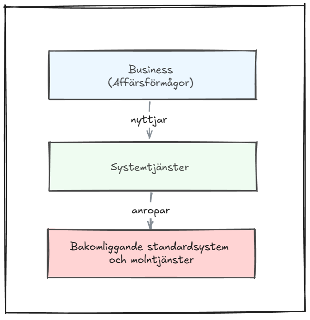

# Att minska gapet mellan verksamhet och IT

> Chapter-ID: att-minska-gapet-mellan-verksamhet-och-it
> Status: draft

Avsikten med den här boken är att fungera som en brygga mellan verksamhetsansvariga och ledning å ena sidan, och lösningsarkitekter och utvecklare å den andra. I teorin borde det inte finnas någon tydlig gräns mellan dessa perspektiv. Inom Enterprise Design ryms både de mjuka frågorna om organisation, affärens mål, ansvar, processer och förändring, och de hårda frågorna om struktur, system, integrationer och teknik.

I praktiken finns det ändå ofta ett gap.

Kanske känner du igen dig i något av följande:

- Lösningsarkitekter och utvecklare använder ett språk som främst förstås av dem själva. Det är så invant att man sällan reflekterar över det.

- Verksamhetens representanter saknar ibland ett gemensamt och etablerat språk för att beskriva sin verklighet på ett sätt som upplevs tillräckligt precist för design och arkitektur.

- De som ansvarar för lösningen upplever verksamhetens beskrivningar som för vaga, medan verksamheten upplever arkitekturen som för teknisk.

Samtidigt visar erfarenhet gång på gång att när verksamhet, arkitekter och utvecklare arbetar tillsammans i ett verkligt tvärfunktionellt team – med mandat från ledningen och tillgång till rätt kompetens – kan resultatet bli mycket starkt. Förutsättningen är att teamet delar en grundläggande förståelse och ett gemensamt språk.

Det är just här svårigheten ligger. Vi vet att gemensam förståelse förbättrar resultatet dramatiskt, men ändå är den svår att uppnå i praktiken.

Ett av bokens viktigaste mål är därför att bidra till ett sådant gemensamt språk – ett språk som gör det möjligt att föra meningsfulla samtal om ansvar, förmågor, tjänster och system utan att fastna i vare sig otydlighet eller teknisk detaljering. Ambitionen är att minska det gap som så ofta uppstår mellan verksamhet och IT, både i projekt och i förvaltning.

Det är en stor ambition, och ingen gör anspråk på att den är fullt uppnådd här. Många har försökt tidigare, och även denna bok bär på begränsningar – inte minst eftersom alla perspektiv inte ryms i en och samma framställning. Om du saknar ett perspektiv, eller ställer frågor som inte besvaras, är det en del av poängen. Hör gärna av dig och bidra med det som saknas.

## AI som stöd

Idag finns nya förutsättningar som tidigare saknat motsvarighet. Med hjälp av AI-baserade verktyg som ChatGPT och Claude kan människor med olika bakgrund och perspektiv ta till sig, bearbeta och ifrågasätta samma material – men på sina egna villkor.

AI kan därmed fungera som ett stöd i just det arbete som den här boken handlar om: att översätta mellan perspektiv, förtydliga resonemang och sänka tröskeln för att ställa frågor. Det skapar ett utrymme för lärande som tidigare varit svårt att åstadkomma så enkelt, och kan bli ett viktigt komplement i arbetet med att minska gapet mellan verksamhet och IT.

AI kan användas för att:

- översätta och omformulera texter

- förtydliga resonemang

- komplettera innehåll med alternativa perspektiv

- ställa frågor till befintligt material och få svar anpassade efter behov och förförståelse

En viktig skillnad jämfört med tidigare är att AI skapar ett tryggt utrymme för utforskande. Det är möjligt att ställa grundläggande eller ”dumma” frågor utan prestige, tidspress eller sociala hinder. Det sänker tröskeln för lärande och gör det lättare för fler att delta i samtal om komplexa frågor.

Rätt använt kan AI därmed fungera som en gemensam tolkningshjälp – ett stöd som bidrar till förståelse snarare än ersätter dialogen mellan människor.

Generativ AI är redan bättre än de flesta av oss att förstå och formulera om och besvara frågor. De kan agera som den kollega vi önskat ha och ge svar utan att tröttna.

Min rekommendation är att ni tar hela den här bokens textinnehåll och använder NotebookLM eller andra gratislösningar för att analysera och ställa frågor om koncepten och begreppen som finns i boken.

Min rekommendation är också att ni använder liknande lösningar för att omformulera era egna texter och därmed höja kvaliteten och öka förståelsen. Det har jag gjort med denna bok.

AI-ger redan fördelar för dessa möjligheter har aldrig funnits förr. Det kan inte på något sätt ersätta det personliga mötet som är det allra bästa sättet att nå ökad förståelse.

## Exempel från företag som hanterar Fordon

Här är ett exempel som skulle kunna gälla alla organisationer som hanterar fordon.
Verksamhetskraven är att alla system och processer som hanterar någon aspekt av Fordon ska ha ett gemensamt register för dem. Idag hanteras det i separata applikationer utan tillräcklig integration med varandra. Dagens hantering av Fordon kräver många manuella steg.

Process ur verksamhetens perspektiv med behov och regelverk
I processerna som hanterar Fordon ska som första steg vara möjligt att registrera Fordon i ett gemensamt register.

Regelverk:

- Ägare som antingen är en organisatorisk enhet internt eller ett externt företag eller en anställd.

- Fordonet kan vara internt eller externt.

- Interna fordon måste ägas av en organisatorisk enhet och det måste finnas en fordonsansvarig angiven.

- Externa fordon måste ägas av en leverantör i leverantörsregistret eller en anställd i personalregistret.

Detta är det regelverk som krävs för den första fasen av projektet. Regelverket ägs av någon som har behov av en lösning.

Finansavdelningen har behov av att hantera Fordon som en tillgång som kräver avskrivning. Säkerhetsavdelningen har behov av att veta vilka fordon som finns inom det inhägnade området oavsett om de är interna eller externt ägda. Ledningen för någon av dessa avdelningar måste vara ägare och ta beslut om regelverkets formuleringar. Regelverket ska uttryckas i vanligt språk med verksamhetens begrepp.

Lösningsarkitekter och utvecklare måste godkänna så formuleringarna är tillräckligt tydliga för att gå att använda som underlag och krav för den kommande lösningen.

Översiktlig bild av grundläggande arkitektur och design för exemplet:

Fig: Grundläggande arkitektur för Fordonshantering

### När arkitekturmodellen möter verksamhetsperspektiv

Samma arkitekturbild kan väcka mycket olika reaktioner, beroende på vilket perspektiv man kommer ifrån.

En ganska vanlig reaktion från verksamhetens representanter:

”Modellen känns för teknisk. Den beskriver inte det vi behöver för att förstå eller engagera oss.”

När verksamheten går in i ett nytt initiativ är det sällan själva arkitekturmodellen som efterfrågas. Det som behövs för att kunna ta ansvar, bidra och fatta beslut är snarare:

- Bakgrund och behov – Varför gör vi detta just nu?

- Nuläge och problem – Vad fungerar inte tillräckligt bra idag?

- Målbild – Vad ska bli bättre, för vem?

- Avgränsning (scope) – Vad ingår och vad ingår inte?

- Verklighetsanknytning - Konkreta exempel från den egna verksamheten

- Förändringsperspektiv – Hur påverkas arbetssätt, roller och ansvar?

- Nästa steg och beslut – Vad förväntas av oss nu?

Reaktionen bottnar ofta i att man inte ser kopplingen mellan modellen och sitt eget ansvar i vardagen. Det är inte ett motstånd mot arkitektur – det är ett uttryck för ansvarstagande.

Verksamhetens perspektiv är därför inte ett hinder, utan ett nödvändigt bidrag. Det hjälper till att hålla fokus på det som verkligen spelar roll: vad vi behöver kunna, vad vi faktiskt gör och vilka som utför det.

### En fråga till dig som reagerar och ifrågasätter arkitekturmodellen

Om de som arbetar med arkitekturen och den tekniska lösningen menar att modellen bidrar till ett gemensamt språk och en förståelse som är viktig för helheten – kan du då se modellen som ett stöd, snarare än ett mål i sig?

Den är inte till för att ersätta verksamhetens bild av verkligheten, utan för att hjälpa olika perspektiv att mötas och förstå varandra.

Det man verkligen bör ifrågasätta är hur omfattande och hur många okända begrepp som den behöver ha för att nå målsättningen att skapa förståelse.

Vi glömmer En fördel med modeller är att det hjälper till att komma ihåg begrepp, definitioner och samband.

Till dig som känner igen allt i arkitekturmodellen

Om majoriteten av verksamhetens representanter reagerar för att de inte känner igen sig i modellen (även om de inte alltid säger det högt), är det en signal. Det kan betyda att teamet inte är tillräckligt tvärfunktionellt, eller att arkitekturen inte ännu är tillräckligt översatt till verksamhetens språk.

Ett team där alla är bekväma från start riskerar att dela samma perspektiv – ofta ett tekniskt sådant.

### God arkitektur

God arkitektur skapas i mötet mellan olika sätt att se på samma problem. Det kräver ömsesidig respekt:

- Verksamheten behöver förstå varför en modell finns.

- Arkitekter och utvecklare behöver förstå varför modellen kan upplevas som främmande.

Att ta varandras reaktioner på allvar är en förutsättning för samarbete.

### En viktig varningssignal

### När alla i ett initiativ tycker att arkitekturbilden är självklar och okomplicerad bör man stanna upp. Det kan vara ett tecken på att:

- teamet domineras av IT-perspektiv

- samma lösningsmönster återanvänds utan att ifrågasättas

- verksamhetens röst har tystnat

### Ett starkt tvärfunktionellt team innehåller friktion
Den är inte ett problem som ska elimineras, utan ett tecken på att flera perspektiv faktiskt är representerade.

Nedan finns beskrivningar av begrepp i arkitekturbilden ovan för att tydliggöra dem.

### Affärsförmågor – vad verksamheten behöver kunna

Affärsförmågor är organisationens stabila ansvarsområden, t.ex. Kundhantering, Orderläggning och Leverans. De beskriver vad vi måste kunna göra för att leverera värde.

”Vi behöver kunna sälja, leverera och få betalt.”

### Systemtjänster – vad vi faktiskt gör i systemstöd

Systemtjänster är de konkreta handlingar (ärenden) som utförs när förmågorna realiseras. De beskriver vad som händer i ett sammanhang och blir de tydliga byggblocken i hur arbetet stöds.

Exempel:

- Registrera kund

- Skapa order

- Planera leverans

- Skicka faktura

- Matcha betalning

”När vi orderlägger så gör systemen vissa tydliga steg – dessa steg är systemtjänster.”

### Standardsystem och molntjänster – vem som levererar funktionaliteten

Standardsystem och molntjänster (t.ex. SAP, CRM, e-handelsplattform, Azure-tjänster) är de leverantörer som utför eller stödjer systemtjänsterna.

”Den här handlingen utförs i SAP, den här i CRM, och den här av en molntjänst.”

### En sammanfattning och beskrivning av arkitekturbilden ovan

Vår övergripande arkitektur beskriver hur verksamhetens affärsförmågor realiseras genom tydliga systemtjänster, och hur dessa i sin tur stöds av standardsystem och molntjänster.

Affärsförmågorna visar vad vi behöver kunna. Systemtjänsterna visar vilka handlingar som utförs för att förmågorna ska fungera. Standardsystem och molntjänster visar var och av vem handlingarna utförs.

Denna uppdelning gör det möjligt att utveckla och förändra systemstödet utan att tappa helheten: förmågorna är stabila, systemtjänsterna ger spårbarhet och ansvar, och plattformarna kan bytas eller kompletteras över tid.

I nästa kapitel finns ytterligare en arkitekturmodell och den är ännu mer svårförstådd, men viktig eftersom den utgör grunden för ett gemensamt språk.

