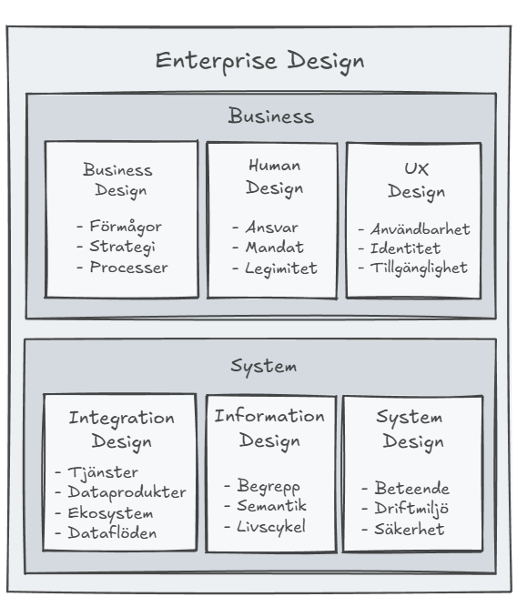

# Enterprise Design – helhetsansvar genom design

> Chapter-ID: enterprise-design-helhetsansvar-genom-design
> Status: draft

I det förra kapitlet har vi sett hur teknisk förändring får mänskliga konsekvenser, och hur dessa konsekvenser sällan är resultatet av enskilda beslut. De uppstår ur strukturer, hur system utformas, hur beslut tas och hur ansvar fördelas – eller inte fördelas. Vi såg till exempel hur automatiseringen av kundtjänstprocesser ledde till oförutsedda konsekvenser för medarbetarna, och hur beslut som fattades isolerat inom IT-avdelningen påverkade hela organisationens arbetsflöden.

Här uppstår ett tomrum som många organisationer känner igen, men få har gett ett namn. Det visar sig när avdelningar investerar i nya system som inte kan kommunicera med varandra – när exempelvis marknadsavdelningen implementerar ett nytt CRM-system som inte kan dela data med ekonomisystemet, vilket skapar dubbelarbete och felaktiga kunduppgifter. Det syns när automatisering av kundprocesser leder till oförutsedda köer i andra delar av organisationen – kanske reducerar en självbetjäningsportal antalet direkta kundkontakter, men genererar istället komplexa specialfall som kräver betydligt mer handläggningstid från backoffice. Eller när välmenande digitaliseringsprojekt fastnar på grund av att ingen har övergripande ansvar för hur delarna hänger ihop – projekt som lever och dör i sina respektive stuprör utan att någon ser att tre olika avdelningar parallellt bygger egna lösningar för samma grundbehov. Detta tomrum märks konkret när organisationer upptäcker att stora investeringar i ny teknik inte ger förväntat värde – antingen för att systemen inte används som tänkt, för att integrationerna blev för komplexa och dyra, eller för att effekterna i ena änden av verksamheten skapar nya flaskhalsar någon annanstans. Det manifesteras också i den frustration som uppstår när ingen kan svara på frågor som berör helheten: Vilka system äger vi egentligen? Vart finns våra kunddata? Varför tar det sex månader att lansera en enkel ny tjänst?

Enterprise Design är kortfattat ett sätt att fylla detta tomrum. Det är ett område som är både bredare och mer konkret än traditionell arkitektur eller strategi. Det handlar om att medvetet forma de strukturer och samband som avgör hur organisationens helhet fungerar över tid – i mötet mellan människa, information och system.

Enterprise Design är varken en metod, ett ramverk eller en enskild roll. Det är snarare ett sätt att se och arbeta med organisationens utformning som helhet, där beslut inom ett område får konsekvenser i många andra. För att kunna beskriva detta område på ett tydligt och konsekvent sätt behöver dock ett centralt begrepp först definieras, eftersom det återkommer genom hela boken: design.

## Design som begrepp

Ordet design används i praktiken i två närliggande men olika betydelser, som behöver hållas isär för att undvika missförstånd.

## Design som aktivitet

Design kan avse ett aktivt, skapande arbete. I denna betydelse handlar design om att medvetet forma något som ännu inte finns, eller att förändra något befintligt, utifrån mål, behov och givna ramar. Design är då en process som omfattar analys, utforskande, beslut och iteration, med syftet att skapa önskade effekter i verkligheten. 

När en organisation designar en ny kundresa, innebär det att man först analyserar nuläget och kundbehov – genom att kartlägga var kunder idag möter friktion eller avbryter sina köp. Sedan utforskas olika lösningsalternativ genom workshops och prototyper – till exempel kan team skissa på alternativa flöden där betalning flyttas tidigare eller där produktinformation presenteras mer visuellt. Beslut fattas om vilken riktning som är mest lovande, och sedan itereras designen baserat på feedback och tester för att användartester att den förenklade betalningsprocessen faktiskt skapar osäkerhet om datasäkerhet, vilket leder till ytterligare designjusteringar. Allt för att skapa en kundupplevelse som faktiskt fungerar i praktiken.

## Design som beskrivning

Design kan också avse resultatet av detta arbete – en beskrivning, struktur eller modell av något som existerar eller är avsett att existera. I denna betydelse används design för att synliggöra hur något hänger ihop: vilka delar som ingår, hur de samverkar och vilka principer som styr helheten. En sådan design fungerar som ett gemensamt språk och ett analysverktyg, oavsett om den beskriver nuläge, målbild eller ett mellanläge.

Inom Enterprise Design är båda betydelserna nödvändiga och ömsesidigt beroende. Design som aktivitet möjliggör förändring och utveckling, medan design som beskrivning skapar förståelse, samordning och ansvar för helheten. Tillsammans gör de det möjligt att både förstå det som är – och medvetet forma det som ska bli.

## Kopplingen mellan Enterprise Design och arkitektur

Enterprise Design och arkitektur är nära sammankopplade, men kan fylla olika roller. Enterprise Architecture är inte så tydligt, men i jämförelse med Enterprise Design så är EA mer inriktat på IT-området.

Enterprise Design formulerar intentionen: målbilden för hur verksamhet, värdeskapande, människor och teknik ska samspela över tid. Det är här riktning sätts, konsekvenser utforskas och principer etableras. Enterprise Architecture(EA) tar därefter vid genom att konkretisera denna design i strukturer, relationer och vägval som kan realiseras och förvaltas.

Arkitekturen fungerar som översättningen mellan designens intention och systemens faktiska utformning. Den använder EA-modeller, principer och styrande beslut för att konkretisera helheten. Helhetsdesignen bryts ned till sammanhängande systemlandskap, informationsstrukturer, integrationsmönster och tekniska plattformar. På så sätt skapar Enterprise Architecture kontinuitet från målbild till genomförande. Den säkerställer att enskilda lösningar bidrar till helheten snarare än optimeras isolerat.

I denna relation är arkitekturen inte ett alternativ till design, utan dess förlängning. Enterprise Design anger vad som behöver uppnås och varför, medan Enterprise Architecture beskriver hur detta kan realiseras på ett hållbart, samordnat och långsiktigt sätt. Tillsammans utgör de länken mellan strategi och system, mellan intention och verklighet.

Enterprise Design omfattar sex designområden:

- Business Design - hur värde skapas, levereras och mäts, samt vilka principer, mål och ramar som styr beslut, risk och investeringar över tid.

Human Design – hur lösningar påverkar människor, hur ansvar, etik och kompetensförsörjning fördelas samt hur förändring leds.

UX Design - hur människor upplever och interagerar med system, hur organisationens identitet uttrycks i gränssnitten, samt hur tillgänglighet och användbarhet säkerställs.

Integration Design - hur system och tjänster kopplas samman och hur dataprodukter används och hur information flödar mellan system och i ekosystem

Information Design - hur tydliga begreppsdefinitioner och konsekvent semantik stärker förståelsen av innehållets betydelse, samt hur begrepps livscykel hanteras.

System Design - hur beteendet för ett system utformas samt hur dess struktur, komponenter och interaktioner organiseras för att uppfylla funktionella och icke-funktionella krav