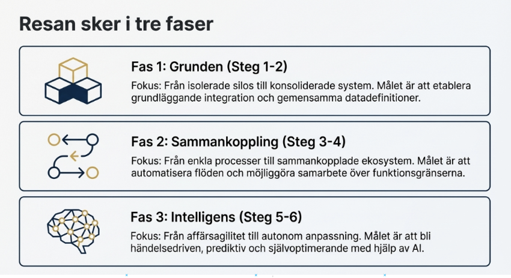

# Modernisering inom integrationsområdet

> Chapter-ID: modernisering-inom-integrationsomradet
> Status: draft

Alla organisationer som vill modernisera sitt sätt att integrera system befinner sig i någon eller ibland i flera av dessa faser. Utvecklingen inom IT, verksamhetskrav och AI driver på för en modernisering.

Fråga till dig:

- Var befinner er organisation sig?

- Befinner ni er på en utvecklingsresa eller har ni inte startat ännu?

- Finns det några mätetal och KPI:er etablerade för att följa utvecklingen?

Ett sätt att förstå sin organisations mognadsgrad och följa utvecklingen är att definiera ett antal KPI:er. Nedan finns exempel på område där utvecklingen kan mätas:

Fas 1:

- Andel applikationer utan integrationer

- Andel manuella åtgärder för att flytta information från ett system till ett annat

- Andel integrationer som använder filöverföring istället för API:er

Fas 2:

- Andel integrationer som använder standardiserade format och API:er

- Antal API:er som återanvänds inom flera domäner

- Antal informationsobjekt som erbjuds via verksamhetsnära tjänster(services)

Fas 3:

- Antal förmågebaserade tjänster

- Antal helt automatiserade arbetsflöden

- Antal integrerade verksamhetskritiska externa tjänster utanför organisationen

- Antal integrerade tjänster erbjudna till slutkund

I en organisation finns alltid system som befinner sig i de första faserna och andra i sena enligt ovanstående modell. Det är normalt och något man får acceptera trots att det leder till skav och intressekonflikter och riskerar utgöra hinder för integrationslösningar som befinner sig i de senare faserna.

Ett exempel när ojämn mognad begränsar möjligheten till förflyttning

En organisation ville man använda mer avancerad analys och AI-stöd för efterfrågeprognoser. Den centrala analysfunktionen hade kommit långt och arbetade redan med tjänsteorienterade lösningar och dataprodukter. Ambitionen var att använda samma information för planering, inköp och uppföljning – och på sikt låta AI-agenter identifiera avvikelser och föreslå åtgärder.

Men en stor del av underlaget kom från ett äldre produktionssystem i en annan del av organisationen. Systemet var stabilt och affärskritiskt, men byggt för ett helt annat arbetssätt. Informationen exponerades endast genom punkt-till-punkt-integrationer, hårt anpassade till specifika mottagare. Begrepp och logik var inbakade på ett sätt som gjorde förändring riskfylld.

För analysfunktionen innebar detta att:

- data inte gick att återanvända utan speciallösningar

- varje förändring krävde ingrepp i flera integrationer

- AI-satsningen fick anpassas till systemets begränsningar

För den andra delen av organisationen upplevdes kraven som orealistiska. Systemet fungerade, levererade det som förväntades och det innebar stora risker att förändra. Varför ändra något som inte var trasigt?

Båda sidor hade rätt. Det som saknades var ett ansvar för att hantera skillnaden i mognad.

I stället för att etablera ett gemensamt tjänstelager eller en dataprodukt som brygga försökte man lösa problemen lokalt. Resultatet blev kompromisser som varken tog tillvara den nya lösningens potential eller skyddade den äldre delen från ökande komplexitet.

Tjänstebaserad arkitektur – där affärsbehov möts av anpassade tjänster

Kommande avsnitt beskriver en tjänstebaserad arkitektur där verksamhetsnära tjänster tillhandahåller definierade informationsobjekt och tjänster. Affärsbehov som uppstår i processer och i samverkan med andra system tillgodoses genom systemtjänster(services) och dessa utgör tillsammans en tjänstebaserad arkitektur.

Genom att exponera funktionalitet via tjänster skapas ett tydligt lager mellan verksamhetens behov och de underliggande applikationerna. Detta innebär att affärsstödet blir mindre beroende av enskilda applikationer och system, vilket ökar flexibiliteten och möjliggör att nya applikationer kan införas eller ersätta befintliga utan att verksamhetens processer och behov behöver förändras.

För att möta integrationsbehoven med hjälp av tjänster krävs en grundläggande struktur som är enkel att förstå och använda av både verksamhetsrepresentanter, lösningsarkitekter och utvecklare. Erfarenhet visar att förmågebaserade modeller som ingick i kapitlet om Business Design är ett av de mest effektiva sätten att strukturera och beskriva organisationens verksamhet. Förmågor kan även med fördel även användas för att skapa ordning och tydlighet i systemlandskapet, inklusive applikationer och integrationer.

