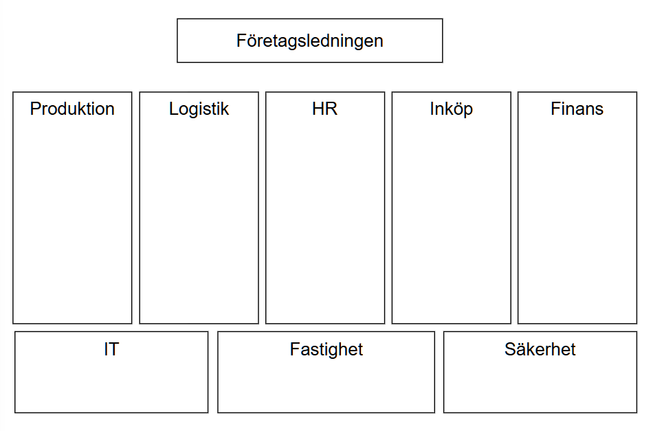

# När arbete förändras

> Chapter-ID: nar-arbete-forandras
> Status: draft

De flesta förändringar sker inte genom stora beslut.
De sker genom små förskjutningar.

Ett nytt system här.
Ett nytt stöd där.
Ett arbetssätt som justeras med goda intentioner.

I efterhand kan det se planerat ut. I stunden upplevs det ofta som diffust.

Människor märker att något är annorlunda innan de kan sätta ord på vad. Arbetsdagen känns inte riktigt likadan. Vissa moment går snabbare. Andra kräver mindre eftertanke. Några uppgifter försvinner helt. Nya dyker upp, ofta utan tydlig introduktion.

Det är då frågorna börjar komma.

- Vem fattar beslutet nu?

- När förväntas jag använda mitt omdöme?

- Vad händer om jag inte håller med systemet?

- Vem bär ansvaret om något går fel?

Om dessa frågor inte får svar uppstår ett tomrum. I det tomrummet fyller människor i själva. Ofta genom försiktighet. Genom att följa systemet även när något skaver. Inte för att de saknar kompetens, utan för att ansvar och mandat inte längre är tydliga.

Det är i denna vardag AI blir verklig.
Inte som vision, utan som praktik.
Inte som strategi, utan som upplevelse.

Marias situation och konsekvenser av AI-införande

Maria har arbetat i samma organisation i nästan tio år.

Hon är inte tekniker.
Hon är inte strateg.

Hon är däremot erfaren och noggrann och respekterad av andra inom organisationen. När något inte stämmer i ett ärende är det ofta hon som ser det först. Inte för att systemen säger till, utan för att hon känner igen mönster. Små avvikelser. Sådant som inte alltid går att formulera i regler, men som märks för den som har sett tillräckligt många fall.

När organisationen började tala om AI skedde det högt upp. Det handlade om effektivitet, kvalitet och framtidssäkring. Presentationerna var övertygande. Argumenten rimliga. Men Maria deltog inte i de diskussionerna. För henne var AI inget initiativ. Det var något som gradvis började märkas i vardagen.

Hennes arbete började förändras.

Ett nytt beslutsstöd infördes. Ärenden som tidigare krävde manuell handläggning kom nu med färdiga rekommendationer. Förslagen var oftast rimliga. Ibland bättre än hennes egna första bedömningar. Till en början kände hon lättnad. Arbetstempot ökade. Köerna minskade. Hon hann mer.

Men efter några månader började något skava.

Hon märkte att hon inte längre behövde tänka på samma sätt. Det som tidigare krävde analys blev till granskning. Det som tidigare var ett aktivt beslut blev till ett godkännande. När hon väl ingrep var det ofta sent i processen, när alternativen redan var begränsade.

Det fanns inga tydliga instruktioner för när hon borde ifrågasätta systemets förslag. Ingen hade sagt vad som förväntades av henne nu. Skulle hon lita på beslutsstödet? Skulle hon använda sin erfarenhet som tidigare? Vad hände om hon gick emot systemets rekommendation och hade fel?

Och vem bar egentligen ansvaret för beslutet – hon, systemet eller någon annan?

Frågorna stannade ofta hos henne själv.

När hon tog upp sin osäkerhet i ett möte fick hon lugnande svar. Systemet var testat. Modellen kvalitetssäkrad. Riskerna bedömda. Men inget av detta svarade på det hon egentligen undrade:

Vad är min roll nu?

Det var inte motstånd hon kände.
Det var förlust av riktning.

Hon började märka hur hennes eget beteende förändrades. Inte medvetet, men gradvis. Hon följde systemets rekommendationer allt oftare. Inte för att hon alltid höll med, utan för att det kändes säkrare. När hon gick emot och fick hon frågor och upplevde att hon behövde försvara sig. När hon följde systemet och något gick fel var ansvaret otydligt.

Det var lättare att inte sticka ut.

Detta är inte ett individuellt misslyckande. Det är ett strukturellt.

När beslut flyttas från människor till system utan att ansvar, mandat och förväntningar flyttas samtidigt uppstår ett vakuum. I det vakuumet gör människor det rationella: de minimerar risk för sig själva. Omdöme ersätts av efterlevnad. Engagemang ersätts av försiktighet.

I efterhand är det lätt att säga att organisationen borde ha utbildat mer. Men problemet är djupare än så. Det handlar inte om kunskap, utan om design.

Beslutsstödet var designat för effektivitet, men inte för omdöme. För att kunna hantera stor belastning, men inte för ansvar. Det saknades tydliga principer för när människan skulle vara i loopen, vad som utgjorde ett rimligt undantag och hur avvikelser skulle hanteras.

Systemet visste när det var säkert.
Människan visste inte när hon behövdes.

Ingen hade tagit helhetsansvar för hur tekniken förändrade arbetet. Hur rollen omformades. Hur omdöme skulle fortsätta vara en del av systemet – inte ett undantag från det.

Detta är den typ av förändring som sällan syns i rapporter. Effektiviteten kan till och med öka på kort sikt. Men långsamt urholkas något annat: tilliten. Till systemen. Till organisationen. Till den egna rollen.

När människor slutar förstå varför de gör som de gör, slutar de också att ta fullt ansvar.

Och när ansvar försvinner ur vardagen blir tekniken farligare än nödvändigt.

Frågor att ställa i din egen organisation:

- Vem i er organisation äger ansvaret för helhetsupplevelsen när ett nytt system införs? Från första implementationen till den långsiktiga påverkan på medarbetaren.

- Hur mäter ni effekten av ett nytt beslutstöd på medarbetares professionella omdöme? Inte enbart kortsiktig utan långsiktig effekt.

Reaktioner på de förväntade AI-förändringarna

Mina kollegor på Solita i Finland har gjort en undersökning ”How AI is transforming Nordic work life 2026” med hundratals intervjuer av personal i de nordiska länderna och det framgår att AI-förändringarna präglas av en paradox: en stark medvetenhet om att arbetet kommer att förändras, men en betydande brist på personliga förberedelser och en tendens att överskatta sin egen förmåga gentemot andras.

Här är de centrala insikterna från källorna om hur människor ser på dessa förändringar:

Förväntad transformation men låg personlig beredskap

Det finns en bred enighet om att AI kommer att förändra arbetslivet fundamentalt, men detta återspeglas inte i hur individer ser på sitt eget behov av kompetensutveckling.

Hög förväntan på förändring: Mellan 76–81 % av de nordiska kunskapsarbetarna förväntar sig att AI kommer att transformera deras arbete inom fem år. I Danmark förväntar sig hela 38 % att deras arbetsuppgifter kommer att ändras i grunden.

Gapet i AI-kunskap: Trots de höga förväntningarna ser endast 6–14% kunskap om AI som avgörande för sin egen karriärutveckling. Detta kallas i källorna för ett ”70-procentenheters gap” mellan förväntan och förberedelse, vilket beskrivs som en tickande tidsinställd bomb.

Låg ersättningsångest: Endast 3–7 % tror att AI kan utföra de flesta eller alla deras nuvarande arbetsuppgifter, vilket tyder på att man inte fruktar att bli helt ersatt, även om arbetsinnehållet förändras.

Synen på sig själv kontra kollegor (Överförtroendefällan)

Källorna visar en tydlig bias i hur man bedömer sin egen prestation i förhållande till sina kollegors när AI används:

Kritiskt tänkande: Svarspersonerna är 2–4 gånger mer benägna att se en förbättring i sitt eget kritiska tänkande än vad de observerar hos sina kollegor.

Negativ bedömning av andra: Medan många anser att AI fungerar som en ”tänkandepartner” för dem själva, tror betydligt fler att AI försämrar kollegornas förmåga till kritiskt tänkande.

Överskattning av sin egen kompetens: Cirka 40 % har observerat att individer eller företag överdriver sin AI-expertis. Samtidigt erkänner endast en bråkdel (3–8 %) att de själva ibland överdriver sin kompetens eller användning.

Motivation och attityder

Inställningen till förändringen skiljer sig också beroende på motivation och inkomst:

Kvalitet vs. snabbhet: De som fokuserar på att använda AI för att höja kvaliteten (särskilt i Danmark, 66 %) tenderar att integrera tekniken djupare och mer hållbart än de som bara fokuserar på att arbeta snabbare.

Inkomstskillnader: Höginkomsttagare använder AI i betydligt högre utsträckning än låginkomsttagare, vilket skapar en risk för en framtida kompetensklyfta.

Sammanfattningsvis ser människor förändringen som oundviklig för yrkesrollen i stort, men de tenderar att se sig själva som mer kompetenta och mindre i behov av ny baskunskap än sin omgivning.

Man kan likna detta vid en storskalig väderprognos: de flesta ser att det drar ihop sig till en rejäl storm (transformationen), men väldigt få har faktiskt börjat spika för fönstren eller köpt regnkläder (kunskap om AI), då de utgår ifrån att deras eget hus på något sätt är mer stabilt än grannens.

Vart är vi på väg?

Detta kapitel ska väcka tankar kring hur varje enskild roll kan komma att förändras på personlig nivå. Därför tar vi som nästa steg ytterligare två exempel på möjliga förändringar för olika yrken. Efter det övergår boken till designfrågor och hur lösningar och plattformar ska designas för att stödja införande av AI-lösningar.

Förändring mot tvärfunktionellt arbetssätt

Många organisationer är fortfarande strukturerade kring funktionsbaserade silos.

Ekonomi arbetar i sina ekonomisystem, inköp i sina inköpssystem och säkerhetsfunktionen med tillträde, hotbilder och regelverk. Varje funktion optimerar sitt eget område, ofta med begränsad insyn i hur helheten påverkas. Samma information hanteras och förädlas parallellt på flera håll, vilket skapar både dubbelarbete och inkonsekvenser.

Samtidigt pågår en tydlig förskjutning mot mer tvärfunktionella arbetssätt, där verksamheten behöver fungera som en sammanhängande helhet snarare än som separata delar. Detta blir särskilt tydligt i genomgående processer, såsom inköp-till-betalning.

I en sådan process krävs ett stort antal överlämningar:

- Verksamheten identifierar ett behov och initierar en inköpsförfrågan.

- Inköp väljer leverantör, tillämpar avtal och skapar beställning, ofta i samverkan med juridik och finans.

- Leveranser tas emot och kontrolleras av logistik, lager eller produktion.

- Fakturor matchas mot beställning och mottagning av ekonomi och inköp.

Ansvaret är utspritt över flera funktioner, vilket gör det oklart vem som har helhetsansvaret för att processen fungerar från början till slut. Det är heller inte självklart att varje medarbetare ser hur det egna processteget påverkar nästa led. Resultatet blir många manuella moment, ökade ledtider och en komplexitet som i sig skapar risk.

När enskilda roller behöver hantera hundratals godkännanden uppstår dessutom en risk för slentrianmässiga beslut. Granskning sker ofta först i efterhand, till exempel vid en incident eller avvikelse, då behovet av spårbarhet blir tydligt – men då är det ofta för sent. Informationen är fragmenterad och sambanden svåra att återskapa.

Detta är i grunden en designfråga. Hur ska processen fungera som helhet? Vilka beslut ska tas manuellt och vilka kan automatiseras? Finns det skäl att använda AI-stöd för att identifiera avvikande mönster i inköp och betalningar, snarare än att i efterhand försöka förstå vad som gick fel?

Leverantören är ett exempel på ett centralt begrepp som förekommer i nästan alla steg – från val och godkännande till leverans, fakturering och betalning. Leverantörer är dock bara ett av många verksamhetskritiska objekt. Det finns hundratals liknande begrepp och datamängder som används av flera delar av organisationen och som är avgörande för helheten. Dessa kallas ofta masterdata. För att kunna följa hela kedjan av händelser krävs gemensamma definitioner och ett gemensamt identitetsbegrepp, så att informationen faktiskt hänger ihop över system- och funktionsgränser.

I takt med ökade krav på kortare ledtider, tätare samarbete med strategiskt viktiga leverantörer och högre krav på kontroll – exempelvis inom underhåll som direkt påverkar produktionsstopp – blir behovet av ett mer sammanhållet och tillförlitligt arbetssätt allt större.

Registervård och hantering av masterdata förändras vid införande av AI. Manuella moment minskar genom automatisering, integrationer och självbetjäning via digitala tjänster. Samtidigt förändras ansvarsfördelningen. När system och processer knyts samman över funktionella gränser blir det allt svårare att hävda att ”det är inte mitt ansvar” eller att information inte får delas. Ansvar förskjuts från lokala delprocesser till ett gemensamt ansvar för helheten.

Denna förskjutning öppnar stora möjligheter till effektivisering, högre kvalitet och bättre styrning, men ställer också nya krav på kompetens, samarbete och arbetssätt. För många medarbetare är detta utvecklande – och på sikt nödvändigt – för att passa in i framtidens organisation.

Vid ett bredare införande av AI förstärks dessa frågor ytterligare. Potentialen att sänka kostnader, öka kvaliteten och förbättra beslutsfattandet är betydande, och det är denna potential som driver utvecklingen mot mer tvärfunktionella arbetssätt. Samtidigt blir förändringen personlig. Ökad transparens, nya arbetssätt och ett större helhetsansvar kan väcka både aktivt och passivt motstånd. Ofta yttrar det sig inte som öppet ifrågasättande, utan genom att arbetet fortsätter som tidigare – trots nya mål, processer och tekniska möjligheter.

Hur väl organisationen lyckas hantera detta är i grunden en ledningsfråga. Det handlar om prioritering, uppföljning och ett systematiskt arbete för att skapa förståelse, delaktighet och engagemang. Utan tydligt ledarskap riskerar tvärfunktionella och AI-drivna initiativ att stanna vid ambitioner, snarare än att få verkligt genomslag i det dagliga arbetet.

