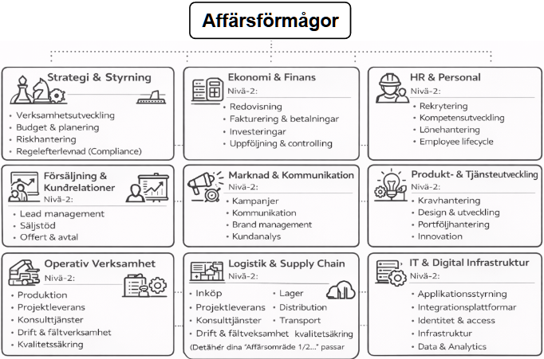
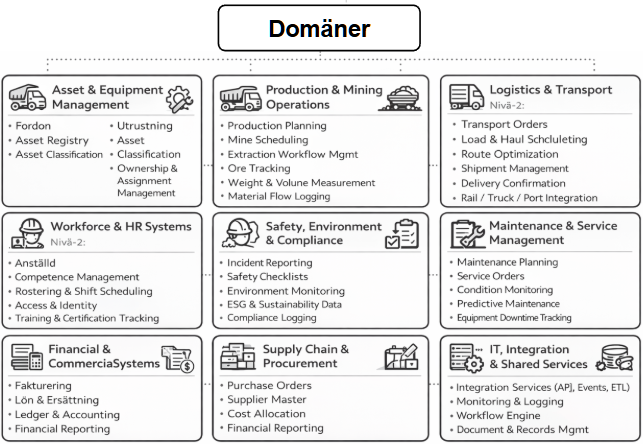
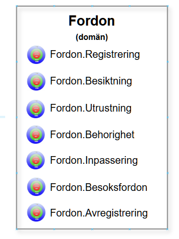

# Systemtjänst (System Service) - del av Integration Design

> Chapter-ID: systemtjanst-system-service-del-av-integration-design
> Status: draft

Systemtjänst(System Service) är en central byggsten i modern integrationsdesign. Det är vad IT-system och applikationer erbjuder och kan leverera som tjänster(services) till olika aktörer. Aktörer kan vara en applikation, en process eller en integration.

En systemtjänst(System Service) är inte ett system – det är ett erbjudande från IT-systemen till verksamheten eller till andra system, interna och externa. Namnsättningen på systemtjänster ska vara verksamhetsnära så att alla som är insatta i verksamheten ska kunna förstå och analysera designförslagen.

Exempel på systemtjänster:

- Skicka faktura

- Validera kundidentitet

- Beräkna moms

- Hämta betalningsstatus

En viktig del av förståelsen är att en Systemtjänst(System Service) kan stödja flera affärsförmågor.

”Skicka faktura” kan exempelvis stödja följande affärsförmågor:

- Fakturering

- Kravhantering

- Projektuppföljning

- Partneravräkning

Systemtjänster är därmed mer konkreta, mer tekniskt färgade och mer föränderliga än affärsförmågor.

Affärsförmågorna förändras inte under en organisations livstid om inte nya verksamhetsområden tillförs eller avyttras. De kan delas upp eller slås samman, men är i huvudsak desamma om det inte sker stor förändring inom verksamheten.

Systemtjänster i sin tur påverkas när systemlandskapet ändras och när regelverk eller behov av information och tjänster förändras vilket sker oftare, men oftast kan kontrakten och gränssnitten mot affärsförmågorna vara kvar.

Relation mellan affärsförmågor och System Services(systemtjänster)

Verksamhetens processer och system knyter samman affärsförmågor och systemtjänst(service). Relationen är inte 1–1, utan många–till–många:

- En affärsförmåga realiseras ofta av flera processer och systemtjänster(System Services)

- En systemtjänst(System Service) kan återanvändas i flera processer och affärsförmågor

En grundregel är att det är systemtjänster(System Services) som bör integreras, versionshanteras och exponeras – inte affärsförmågor.

Vilka krav kan man ställa på en Systemtjänst(System Service)?

En systemtjänst(service) måste vara tillräckligt stor för att vara intressant i designarbetet, men samtidigt inte alltför stor och omfattande för då döljs viktiga detaljer och designen uförs på alltför hög nivå.

Som guide kan man utgå för vad som är gemensamt för systemtjänst(service):

- de kan exponeras

- de kan återanvändas

- de kan ägas av ett team

Rekommendation: Börja med en enkel modell

Affärsförmågor kan struktureras i många nivåer liksom processer, men bör inte modelleras i mer än två nivåer för att behålla överblick och strategisk relevans. Om det är alltför många nivåer blir det svårt att förstå. För varje förmåga kan det finnas en beskrivning och i den kan det framgå i text vilka förmågor på nivå 3 och 4 som ingår.

systemtjänst(service) behöver också struktureras i domäner för att förenkla användning och för skapa en enkel struktur och i båda fallen exponeras tjänster(services) som utför själva funktionaliteten.

Exempel:

Min rekommendation är att detaljer bortom nivå två hör hemma i:

- förmågebeskrivningar

- domänmodeller (DDD)

- processbeskrivningar

- lösningsarkitektur

- API- och tjänstekontrakt

och inte i förmågemodellen. Då blir den svår att förstå och ger inte samma översiktliga bild som är viktigt för verksamhetens förståelse.

Förmågemodeller i relation till DDD, Information Design och Integration Design

Förmågemodeller fungerar som en brygga mellan strategi och arkitektur:

- Affärsförmågor ger kontext och sammanhang

- Systemtjänst(service)s innehåll och semantik konkretiseras via Information Design

- Exponerade Systemtjänst(service) realiseras genom Integration Design

Rätt använda så ger förmågemodeller:

- fokus på rätt nivå

- stabila beslutsunderlag

- minskad modelltrötthet

Fel använda och alltför komplicerade blir de snabbt bli obegripliga för mottagarna.

Ett exempel på förmågor och tjänsteorientering från gruvindustrin

Tjänsteorientering är när man utgående från olika områden som kallas domäner definierar systemtjänster(System Services) som används av olika aktörer som processer, andra tjänster och AI-agenter.

Här är ett första förenklat exempel på förmågemodell från gruvindustrin:

Affärsförmågor (Business Capabilities)

Exempel på domäner för att stödja ovanstående affärsförmågor.

Varje domän har tjänster som kan användas av olika aktörer och här exemplifieras det med dessa systemtjänster som finns i domänen Fordon:

Definitioner och metamodell

Detta är beprövad praxis med enkla, strikta begrepp som fungerar i design, DDD-inspirerad struktur och integration/API-design.

System Service(systemtjänst) stödjer en eller flera affärsförmågor och är knutna till en specifik domän. På kodnivå realiseras tjänsternas funktioner och operationer genom applikationer eller mikrotjänster, men de är oftast inte med i designen utan tillhör lösningsarkitekturen.

Affärsförmåga (Business Capability)

Vad verksamheten behöver kunna göra för att skapa värde.

- Stabil över tid

- Teknikoberoende

- Används för styrning och prioritering

Exempel: Fakturering, Kundhantering

Domän (Service Domain)

Ett verksamhetsnära område som grupperar relaterade tjänster för att ge struktur och ökad förståelse.

- Speglar verksamhetens begrepp

- Används för struktur och ägarskap

- Liknar DDD-domäner

Exempel: Billing, Customer, Identity

System Service (tjänst)

Ett tekniskt erbjudande med tydligt kontrakt som kan användas av flera.

- Versionshanteras

- Integreras via API/event

- Stödjer en eller flera affärsförmågor

Exempel: Skicka faktura, Validera kund

Detta är den lägsta nivån som hör hemma i designmodellen

Applikation / mikrotjänst

Den tekniska miljön och lösningen som implementerar tjänsterna i kod.

- Föränderlig

- Team- och tekniknära

- Versionshanteras

Exempel: Faktureringssystem, CRM

Tumregel

Om något har ett kontrakt och kan användas av flera – då är det en System Service.
Om inte – då är det implementation och hör inte hemma i DESIGN-kartan.

Varför detta fungerar

- Affärsförmågor ger riktning

- Domäner ger struktur

- System Services ger integration och ansvar

- Applikationer ger genomförande

Detta räcker i 90 % av alla fall.

